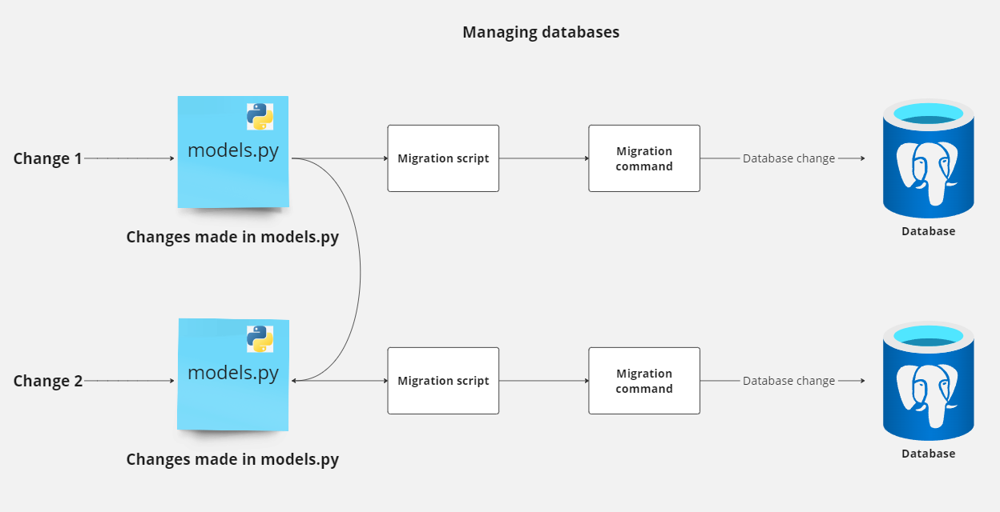

# Database management system

This project houses codes that manages the `flexitricity` database. The database is a PostgreSQL database hosted on Azure. The main tool to manage this database is `alembic`, a Python framework. 

To read more about alembic, visit the [alembic documentation](https://alembic.sqlalchemy.org/en/latest/).

The credentials are stored in a `.env` file. The file is not included in the repository. An example file `.env-example` is tracked which can be used to create the `.env` file.

A typical `.env` file looks like this:

```
PSQL_PASSWORD=
PSQL_HOST=
PSQL_DATABASE=
PSQL_PORT=
PSQL_USER=
```

The file is used to store credentials for the database.

# Virtual environment creation 

To create a virtual environment, run the following command in the terminal:

```
python3.11 -m venv db-mgmt-env
```

To activate the virtual environment, run the command: 

```
# Bash
source db-mgmt-env/bin/activate

# Powershell
.\db-mgmt-env\Scripts\activate.ps1
```

All the packages are in the `requirements.txt` file. To install the packages, run the command:

```
pip install -r requirements.txt
```

# Using alembic

The first command in an empty project is to run the command: 

```
alembic init alembic
```

The above command will create a directory called `alembic` in the project. This directory contains the following files:

```
alembic/
    env.py
    README
    script.py.mako
    versions/
        __init__.py
```

The `env.py` file is used to create a `alembic` environment. The `versions` folder contains the database migration files. The `script.py.mako` file is a template file used to create new migration files.

A high-level overview of the process is as follows:



## Creating a new migration

A migration is a file that contains the changes to the database.

All the database tables are defined in python in the `models.py` file.

A typical database table example: 

```python
class User(Base):
    __tablename__ = 'users'

    id = Column(Integer, primary_key=True)
    name = Column(String)
    fullname = Column(String)
    nickname = Column(String)

    def __repr__(self):
        return f"<User(name={self.name}, fullname={self.fullname}, nickname={self.nickname})>"
```

For alembic to track the changes and create a migration, run the command:

```
alembic revision --autogenerate -m "message"
```

This will create a new revision file in the `alembic/versions` folder:

```
alembic/
    versions/
        3e8e0e3e8e0e_create_user_table.py
```

The contents of the file will look like this:

```python
"""create user table

Revision ID: 3e8e0e3e8e0e
Revises:
Create Date: 2021-10-14 14:00:00.000000

"""
from alembic import op
import sqlalchemy as sa


# revision identifiers, used by Alembic.
revision = '3e8e0e3e8e0e'
down_revision = None
branch_labels = None
depends_on = None

def upgrade():
    op.create_table(
        'users',
        sa.Column('id', sa.Integer, primary_key=True),
        sa.Column('name', sa.String),
        sa.Column('fullname', sa.String),
        sa.Column('nickname', sa.String)
    )


def downgrade():
    op.drop_table('users')
```

Each migration has a `upgrade` and `downgrade` function. The `upgrade` function is used to apply the changes to the database. The `downgrade` function is used to rollback the changes.

## Applying the changes

To apply the changes to the database, run the command: 

```
alembic upgrade head
```